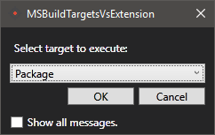

# MSBuild Targets Visual Studio Extension



Allows the execution of custom MSbuild targets (added to your .csproj file) from the Visual Studio IDE, in a manner similar to the Ant/Eclipse integration. The extension adds the "Execute Target..." menu item to the right-click context menu of the Project items in Solution Explorer.


Custom MSBuild target examples include creating a Nuget or Chocolatey package from your project binaries, publishing a site with custom actions, cleaning the project output folders, etc.

The MSBuild output is formatted and redirected to the Visual Studio Output window.

## Examples:

### Target for creating a Nuget package from a C# project file:
```xml
<Target Name="Package" DependsOnTargets="Build">
  <Message Importance="High" Text="Package" />
  <MakeDir Directories="bin\Nuget" />
  <Exec Command="nuget.exe pack -NoPackageAnalysis -NonInteractive $(MSBuildProjectName).csproj" />
</Target>
```

### Target for cleaning up the project output folders:
```xml
<Target Name="CleanOutputs">
  <Message Text="CleanOutputs" Importance="high" />
  <RemoveDir Directories="$(OutputPath);obj" ContinueOnError="true">
    <Output TaskParameter="RemovedDirectories" ItemName="removed" />
  </RemoveDir>
  <Message Text="Removed: %(removed.FullPath)" Importance="high" />
</Target>
```

